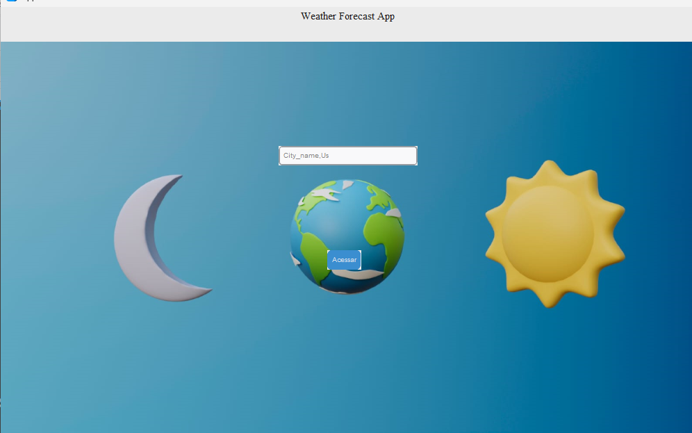
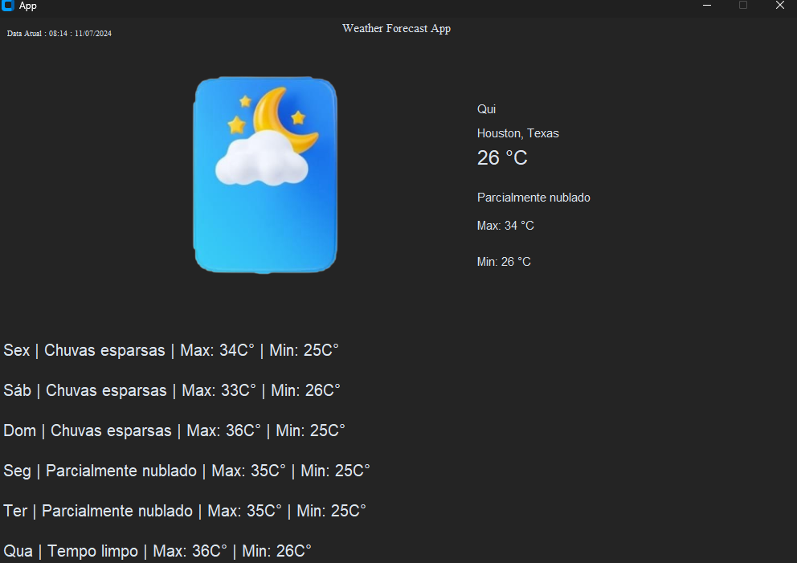

# python_app_clima

# <<<<<<< HEAD

aplicação para acessar o clima de determinada cidade , passando como parãmetro a cidade e pais, podendo visualizar a previsão do tempo além da temperatura maxima e minima.

## Telas:

    

